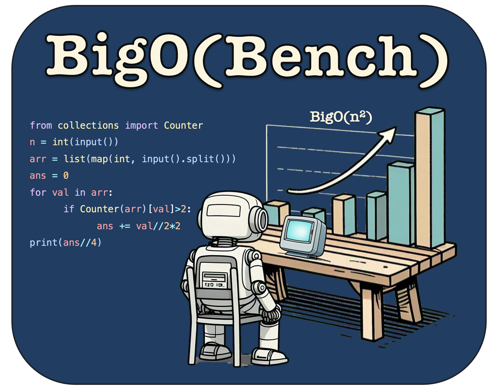
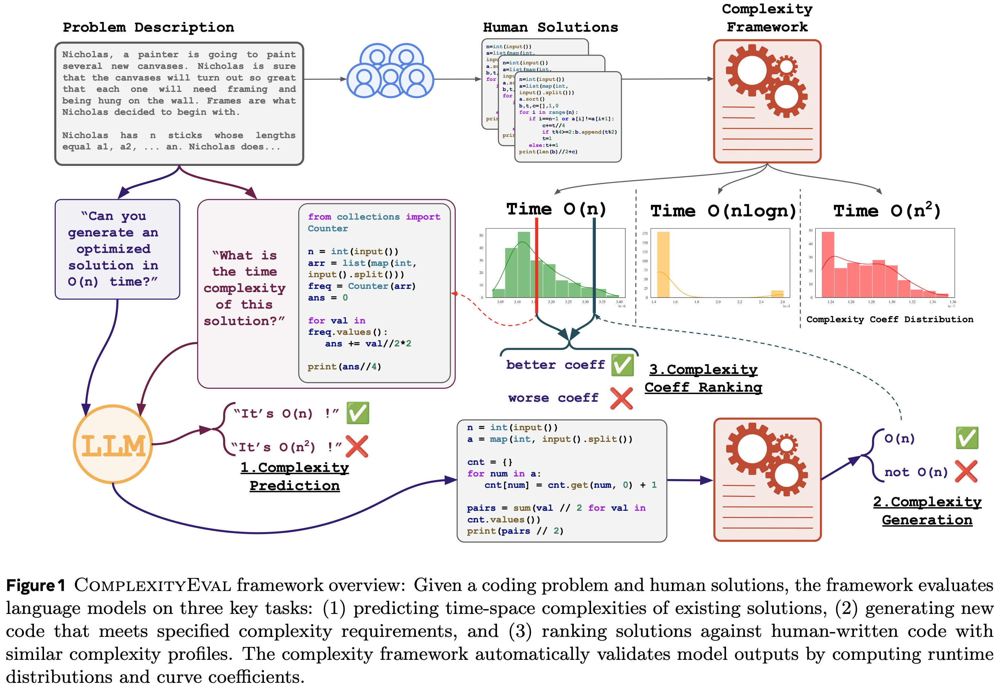

<h1 align="center">
    <!-- <p><b><i>BigO(Bench)</b></i></p> -->
    
</h1>

<div align="center" style="line-height: 1;">
  <a href="https://facebookresearch.github.io/bigobench" target="_blank" style="margin: 2px; text-decoration: none !important;"></a>
  <a href="https://facebookresearch.github.io/bigobench/leaderboard.html" target="_blank" style="margin: 2px; text-decoration: none !important;"></a>
  <a href="https://facebookresearch.github.io/bigobench/demo.html" target="_blank" style="margin: 2px; text-decoration: none !important;"></a>
</div>
<div align="center" style="line-height: 1;">
  <a href="https://github.com/facebookresearch/BigOBench" target="_blank" style="margin: 2px; text-decoration: none !important;"></a>
  <a href="https://huggingface.co/datasets/facebook/BigOBench" target="_blank" style="margin: 2px; text-decoration: none !important;"></a>
</div>
<div align="center" style="line-height: 1;"><a href="https://arxiv.org/abs/2503.15242" target="_blank" style="margin: 2px; text-decoration: none !important;"></a>
</div>

<h2 align="center">
    <p><i>Can LLMs Generate Code with <br> Controlled Time and Space Complexity?</i></p>
</h2>

## 👋 Overview

* [🧐 Introduction](#-introduction-back-to-top)

* [🙌 Project Overview](#-project-overview-back-to-top)

* [📋 Getting Started with the CODE](#-getting-started-with-the-code-back-to-top)

* [📚 Getting Started with the DATA](#-getting-started-with-the-data-back-to-top)

* [💯 BigO(Bench) Scores](#-bigobench-scores-back-to-top)

* [🤗 Running BigO(Bench) on (your) HuggingFace Models](#-running-bigobench-on-your-huggingface-models-back-to-top)

* [👨‍💻 Running BigO(Bench) on OpenAI Models](#-running-bigobench-on-openai-models-back-to-top)

* [🤖 Running BigO(Bench) on anything else that runs !](#-running-bigobench-on-anything-else-that-runs--back-to-top)

* [🔬📈 Running the Dynamic Complexity Inference Framework on code snippets](#-running-the-dynamic-complexity-inference-framework-on-code-snippets-back-to-top)

* [🙏 Acknowledgements](#-acknowledgements-back-to-top)

* [License](#license-back-to-top)

* [📝 Citation](#-citation-back-to-top)

> [!NOTE]
> Significant refactoring efforts have been made to enhance the usability and clarity of our codebase for public users. As we continue to identify and address any bugs, we will be pushing regular patches. If you encounter any issues or spot a bug, please don't hesitate to reach out – we would be delighted to investigate and resolve it promptly.

## 🧐 Introduction <sub><sup>([back to top](#-overview))<sub><sup>



<span style="font-variant: small-caps;"><b>BigO(Bench)</b></span> is a benchmark of ~300 code problems to be solved in Python, that evaluates whether LLMs can find the time-space complexity of code solutions or generate code solutions themselves that respect a time-space complexity requirement. This benchmark addresses the gap in current evaluations that often overlook the ability of models to comprehend and produce code constrained by computational complexity. <span style="font-variant: small-caps;"><b>BigO(Bench)</b></span> includes a complexity inference framework that can run any Python code snippet, measure multiple runtime and memory footprint values, and infer its algorithmic time-space complexity. It also includes of set of 3,105 coding problems and 1,190,250 solutions from Code Contests annotated with inferred (synthetic) time and space complexity labels from the complexity framework, as well as corresponding runtime and memory footprint values for a large set of input sizes.

## 🙌 Project Overview <sub><sup>([back to top](#-overview))<sub><sup>

Our project contains the following modules, and each of them is documented in its attached README file !

* `BigOBench/data`

    * [📋 Getting Started with the data](./data/README.md#-getting-started-with-the-data-back-to-top-back-to-root)
    
    * [🔥 `problem_and_human_solutions_list.jsonl`](./data/README.md#-problem_and_human_solutions_listjsonl-back-to-top-back-to-root)
    
    * [🔥 `complexity_labels_light.jsonl`](./data/README.md#-complexity_labels_lightjsonl-back-to-top-back-to-root)
    
    * [🔥 `complexity_labels_full.jsonl`](./data/README.md#-complexity_labels_fulljsonl-back-to-top-back-to-root)
    
    * [🔥 `time_complexity_test_set.jsonl`](./data/README.md#-time_complexity_test_setjsonl-back-to-top-back-to-root)
    
    * [🔥 `space_complexity_test_set.jsonl`](./data/README.md#-space_complexity_test_setjsonl-back-to-top-back-to-root)

* `BigOBench/docs`

    * [🔎 Sample Explorer](./docs/README.md#-sample-explorer-back-to-root)

* `BigOBench/src`

    * [📋 Environment setup](./src/README.md#-environment-setup-back-to-top-back-to-root)

    * [🔥1️⃣ Launch Inference Engine - `src/inference`](./src/README.md#1%EF%B8%8F⃣-launch-inference-engine---srcinference-back-to-top-back-to-root)

    * [🔥2️⃣ Run Evaluation Inference - `src/eval`](./src/README.md#2%EF%B8%8F⃣-run-evaluation-inference---srceval-back-to-top-back-to-root)

    * [🔥3️⃣ Post-process with the Complexity Framework - `src/complexity`](./src/README.md#3%EF%B8%8F⃣-post-process-with-the-complexity-framework---srccomplexity-back-to-top-back-to-root)

    * [🔥4️⃣ Get the scores - `src/eval`](./src/README.md#4%EF%B8%8F⃣-get-the-scores---srceval-back-to-top-back-to-root)

    * [🤹 Examples](./src/README.md#-examples-back-to-top-back-to-root)

    * `BigOBench/src/complexity`

        * [📋 Environment setup](./src/complexity/README.md#-environment-setup-back-to-top-back-to-root)

        * [🔥 Running the complexity framework within a Python script ](./src/complexity/README.md#-running-the-complexity-framework-within-a-python-script-back-to-top-back-to-root)

        * [🔥🔥 Running the complexity framework from the CLI](./src/complexity/README.md#-running-the-complexity-framework-from-the-cli-back-to-top-back-to-root)

        * [🔥🔥🔥 Running the complexity framework with SLURM](./src/complexity/README.md#-running-the-complexity-framework-with-slurm-back-to-top-back-to-root)

        * [📚 Dataset Requirements](./src/complexity/README.md#-dataset-requirements-back-to-top-back-to-root)

        * [⚒️⚙️ Configuration Options](./src/complexity/README.md#%EF%B8%8F%EF%B8%8F-configuration-options-back-to-top-back-to-root)

        * [👷🚧 Follow ups !](./src/complexity/README.md#-follow-ups--back-to-top-back-to-root)

    * `BigOBench/src/eval`

        * [📋 Environment setup](./src/eval/README.md#-environment-setup-back-to-top-back-to-root)

        * [1️⃣🔥 Inference Engine](./src/eval/README.md#1%EF%B8%8F%E2%83%A3-inference-engine-back-to-top-back-to-root)

        * [2️⃣🔥 Launching evaluation inference !](./src/eval/README.md#2%EF%B8%8F⃣-launching-evaluation-inference--back-to-top-back-to-root)

        * [3️⃣🔥 Post-processing of the metrics !](./src/eval/README.md#3%EF%B8%8F⃣-post-processing-of-the-metrics--back-to-top-back-to-root)

    * `BigOBench/src/inference`

        * [📋 Environment setup](./src/inference/README.md#-environment-setup-back-to-top-back-to-root)

        * [🔥 Launching vllm server - in local ! ](./src/inference/README.md#-launching-vllm-server---in-local--back-to-top-back-to-root)

        * [🔥🔥 Launching vllm server - using SLURM !](./src/inference/README.md#-launching-vllm-server---using-slurm--back-to-top-back-to-root)

        * [🧪🔬 Quick VLLM inference](./src/inference/README.md#-quick-vllm-inference-back-to-top-back-to-root)

## 📋 Getting Started with the CODE <sub><sup>([back to top](#-overview))<sub><sup>
To clone the repository, run

```bash
git clone git@github.com:facebookresearch/BigOBench.git
cd BigOBench
```

If you want to install everything at once, and run the BigOBench benchmark:

```bash
cd src
bash create_bigobench_env.sh
```

And then navigate to [src/README.md](./src/README.md) to read about how to run the full BigOBench evaluation pipeline.

Otherwise, if you are specifically interested in one of our modules, you can install the dependencies of each module separately:
* For the complexity framework:
    ```bash
    cd src/complexity
    bash create_complexity_env.sh
    ```
    You can then navigate to [src/complexity/README.md](./src/complexity/README.md) to get to know the complexity framework.


* For the inference engine:
    ```bash
    cd src/inference
    bash create_vllm_env.sh
    ```
    You can then navigate to [src/inference/README.md](./src/inference/README.md) to get to know the inference engine.

* For the evaluation harness:
    ```bash
    cd src/eval
    bash create_eval_env.sh
    ```
    You can then navigate to [src/eval/README.md](./src/eval/README.md) to get to know the evaluation harness.

## 📚 Getting Started with the DATA <sub><sup>([back to top](#-overview))<sub><sup>

The data is available in 5 `.jsonl` files, hosted by [HuggingFace Datasets](https://huggingface.co/datasets/facebook/BigOBench).  
You can directly download them from the HuggingFace website, or use the CLI

```bash
cd /data
huggingface-cli download facebook/BigOBench --repo-type dataset --local-dir ./temp_dir
mv ./temp_dir/data/* .
rm -r ./temp_dir
```

This will give you access to the following files:

* `problem_and_human_solutions_list.jsonl` 3,105 coding problems and 1,190,250 solutions from Code Contests, including inferred dataclasses and other metadatas.

* `complexity_labels_light.jsonl` time and space complexity and curve coefficients for all 1,190,250 code solutions, as labeled by the dynamic complexity framework.

* `complexity_labels_full.jsonl` all time and space complexity and curve coefficients, along with the runtime and memory footprint measures, for all 1,190,250 code solutions, as labeled by the dynamic complexity framework.

* `time_complexity_test_set.jsonl` 311 problems and 640 corresponding solutions covering 11 different time complexity classes. 

* `space_complexity_test_set.jsonl` 308 problems and 636 solutions covering 5 different space complexity classes.

## 💯 BigO(Bench) Scores <sub><sup>([back to top](#-overview))<sub><sup>

BigO(Bench) produces metrics for 3 different tasks, evaluating the performance of LLMs for:

* **Complexity Prediction**, that is to say the capability of a model to predict the time or space complexity of a snippet of code:

    * **Time** Complexity Prediction:

        * `complexity_prediction/time/pass_at_1`: For each problem and time complexity class that exists for solutions to this problem (according to the human pull of correct solutions), does the LLM correctly predict the time complexity of a solution to this problem, having this class of complexity (as measured by the complexity framework) ? The score is either 0 or 100, macro-averaged over the classes of complexity of each problem, and then macro-averaged over the problems of the test set.

        * `complexity_prediction/time/best_at_1`: For each problem, taking the best time complexity class that exists for this problem (and only this class), does the LLM correctly predict the time complexity of a solution to this problem, having this class of complexity (as measured by the complexity framework) ? The score is either 0 or 100, directly macro-averaged over the problems of the test set, as we only measure for the best time complexity class of each problem.

        * `complexity_prediction/time/all_at_1`: For each problem, taking all the classes of time complexity that exists according to the solutions to this problem (according to the human pull of correct solutions), does the LLM correctly predict the time complexity of a solution to each time complexity class for this problem simultaneously ? The score is either 0 or 100, directly macro-averaged over the problems of the test set, as we only measure one time this metric for each problem, using all classes of complexity at the same time.

    * **Space** Complexity Prediction:

        * `complexity_prediction/space/pass_at_1`: Equivalent to `complexity_prediction/time/pass_at_1` but based on the space complexity classes.

        * `complexity_prediction/space/best_at_1`: Equivalent to `complexity_prediction/time/best_at_1` but based on the space complexity classes.

        * `complexity_prediction/space/all_at_1`: Equivalent to `complexity_prediction/time/all_at_1` but based on the space complexity classes.

* **Complexity Generation**, that is to say the capability of a model to generate a correct solution to a coding problem, that fulfills a time or space complexity requirement:

    * **Time** Complexity Generation:

        * `complexity_generation/time/pass_at_1`: For each problem and time complexity class that exists to this problem (looking at the pull of correct human solutions to this problem and running the complexity framework on these solutions), can the LLM generate a solution to this problem that is correct, with a specific time complexity requirement which is NOT verified (this metric only accounts for the correctness of the solution, not of the complexity requirement) ? The score is either 0 or 100, macro-averaged over the classes of complexity of each problem, and then macro-averaged over the problems of the test set.

        * `complexity_generation/time/pass_at_10`: Pass@10 version of `complexity_generation/time/pass_at_1`.

        * `complexity_generation/time/time_at_1`: For each problem and time complexity class that exists to this problem (looking at the pull of correct human solutions to this problem and running the complexity framework on these solutions), can the LLM generate a solution to this problem that is correct, with a specific time complexity requirement which HAS TO BE verified (this metric accounts for the correctness of the solution AND of the complexity requirement, both together) ? The score is either 0 or 100, macro-averaged over the classes of complexity of each problem, and then macro-averaged over the problems of the test set.

        * `complexity_generation/time/time_at_10`: Pass@10 version of `complexity_generation/time/time_at_10`.

        * `complexity_generation/time/best_time_at_1`: For each problem and taking the best complexity class that exists to this problem (looking at the pull of correct human solutions to this problem and running the complexity framework on these solutions), can the LLM generate a solution to this problem that is correct, with a specific time complexity requirement which HAS TO BE verified (this metric accounts for the correctness of the solution AND of the complexity requirement, both together) ? The score is either 0 or 100, directly macro-averaged over the problems of the test set, as we only consider the best time complexity class of each problem.

        * `complexity_generation/time/all_time_at_1`:For each problem and taking all complexity classes that exists to this problem together (looking at the pull of correct human solutions to this problem and running the complexity framework on these solutions), can the LLM generate a solution to this problem that is correct, with a specific time complexity requirement which HAS TO BE verified (this metric accounts for the correctness of the solution AND of the complexity requirement, both together), and do that simultaneously for all the complexity classes ? So this metric measures whether the LLM can simultaneously generate correct code fulfilling the complexity requirement of each time complexity class that exists to the problem. The score is either 0 or 100, directly macro-averaged over the problems of the test set, as we consider all the classes of complexity to the problem together.

    * **Space** Complexity Generation:

        * `complexity_generation/space/pass_at_1`: Equivalent to `complexity_generation/time/pass_at_1` but based on the space complexity classes.

        * `complexity_generation/space/pass_at_10`: Equivalent to `complexity_generation/time/pass_at_10` but based on the space complexity classes.

        * `complexity_generation/space/space_at_1`: Equivalent to `complexity_generation/time/time_at_1` but based on the space complexity classes.

        * `complexity_generation/space/space_at_10`: Equivalent to `complexity_generation/time/time_at_10` but based on the space complexity classes.

        * `complexity_generation/space/best_space_at_1`: Equivalent to `complexity_generation/time/best_time_at_1` but based on the space complexity classes.

        * `complexity_generation/space/all_space_at_1`: Equivalent to `complexity_generation/time/all_time_at_1` but based on the space complexity classes.

* **Complexity Ranking**, that is to say the capability of a model to generate a correct solution to a coding problem, that fulfills a time or space complexity requirement, and has to be as optimize as possible while staying in the specified complexity class, so to be compared with the human solutions of the same problem and complexity class and ranked among these:

    * **Time** Complexity Ranking:

        * `complexity_ranking/time/pass_at_1`: For each problem and time complexity class that exists to this problem (looking at the pull of correct human solutions to this problem and running the complexity framework on these solutions), can the LLM generate a solution to this problem that is correct, as optimized as possible (though this metric does not measure the optimization level), with a specific time complexity requirement which is NOT verified (this metric only accounts for the correctness of the solution, not of the complexity requirement) ? The score is either 0 or 100, macro-averaged over the classes of complexity of each problem, and then macro-averaged over the problems of the test set.

        * `complexity_ranking/time/pass_at_10`: Pass@10 version of `complexity_ranking/time/pass_at_1`.

        * `complexity_ranking/time/time_at_1`: For each problem and time complexity class that exists to this problem (looking at the pull of correct human solutions to this problem and running the complexity framework on these solutions), can the LLM generate a solution to this problem that is correct, as optimized as possible (though this metric does not measure the optimization level), with a specific time complexity requirement which HAS TO BE verified (this metric accounts for the correctness of the solution AND of the complexity requirement, both together) ? The score is either 0 or 100, macro-averaged over the classes of complexity of each problem, and then macro-averaged over the problems of the test set.

        * `complexity_ranking/time/time_at_10`: Pass@10 version of `complexity_ranking/time/time_at_10`.

        * `complexity_ranking/time/best_time_at_1`: For each problem and taking the best complexity class that exists to this problem (looking at the pull of correct human solutions to this problem and running the complexity framework on these solutions), can the LLM generate a solution to this problem that is correct, as optimized as possible (though this metric does not measure the optimization level), with a specific time complexity requirement which HAS TO BE verified (this metric accounts for the correctness of the solution AND of the complexity requirement, both together) ? The score is either 0 or 100, directly macro-averaged over the problems of the test set, as we only consider the best time complexity class of each problem.

        * `complexity_ranking/time/all_time_at_1`: For each problem and taking all complexity classes that exists to this problem together (looking at the pull of correct human solutions to this problem and running the complexity framework on these solutions), can the LLM generate a solution to this problem that is correct, as optimized as possible (though this metric does not measure the optimization level), with a specific time complexity requirement which HAS TO BE verified (this metric accounts for the correctness of the solution AND of the complexity requirement, both together), and do that simultaneously for all the complexity classes ? So this metric measures whether the LLM can simultaneously generate correct code fulfilling the complexity requirement of each time complexity class that exists to the problem, while putting a requirement of optimizing the code as much as possible (though this metric does not measure the level of optimization). The score is either 0 or 100, directly macro-averaged over the problems of the test set, as we consider all the classes of complexity to the problem together.

        * `complexity_ranking/time/coefficient_ranking_full`: For each problem and time complexity class that exists to this problem (looking at the pull of correct human solutions to this problem and running the complexity framework on these solutions), can the LLM generate a solution to this problem that is correct, as optimized as possible, with a specific time complexity requirement which HAS TO BE verified ? This metric then gives a score of 0 if the solution is incorrect or does not check the complexity requirement; otherwise, if the solution passes both the correctness and complexity check, it ranks it among human solutions of the same problem and class of complexity, using the coefficients of the curve of runtimes used to infer the time complexity class of each solution, and gives a percentile ranking score between 0 and 100 (0 meaning that the solution ranks the worst among all human solutions, and 100 that it ranks the best). The score is then macro-averaged over the classes of complexity of each problem, and then macro-averaged over the problems of the test set.

    * **Space** Complexity Ranking:

        * `complexity_ranking/space/pass_at_1`: Equivalent to `complexity_ranking/time/pass_at_1` but based on the space complexity classes.

        * `complexity_ranking/space/pass_at_10`: Equivalent to `complexity_ranking/time/pass_at_10` but based on the space complexity classes.

        * `complexity_ranking/space/space_at_1`: Equivalent to `complexity_ranking/time/time_at_1` but based on the space complexity classes.

        * `complexity_ranking/space/space_at_10`: Equivalent to `complexity_ranking/time/time_at_10` but based on the space complexity classes.

        * `complexity_ranking/space/best_space_at_1`: Equivalent to `complexity_ranking/time/best_time_at_1` but based on the space complexity classes.

        * `complexity_ranking/space/all_space_at_1`: Equivalent to `complexity_ranking/time/all_time_at_1` but based on the space complexity classes.

        * `complexity_ranking/space/coefficient_ranking_full`: Equivalent to `complexity_ranking/time/coefficient_ranking_full` but based on the space complexity classes.

## 🤗 Running BigO(Bench) on (your) HuggingFace Models <sub><sup>([back to top](#-overview))<sub><sup>

BigO(Bench) can be run on any HuggingFace Model (\* provided that it is compatible with the VLLM library, but that's the case of many of the HuggingFace models). 

We provide scripts that can be run in local, or via SLURM allocated machines, so to parallelize the evaluation. You will find more details on how to evaluate a HuggingFace model in [`src/README.md`](./src/README.md), and detailed examples in [`src/example_huggingface_in_local.md`](./src/example_huggingface_in_local.md) for running the evaluation in local, and [`src/example_huggingface_with_slurm.md`](./src/example_huggingface_with_slurm.md) to run the evaluation with SLURM.

As a quick overview on how to run the evaluation:

1. Going into `src/inference`, you can launch an inference engine for a HuggingFace model, running in local or on SLURM-allocated machines.

2. Then, using `src/eval`, the evaluation harness can call the model inference engine to answer all the questions of the benchmark.

3. Based on `src/complexity`, the complexity framework can evaluate that LLM-generated solutions do respect the complexity requirement (for time/space complexity generation and ranking tasks, whereas time/space prediction tasks do not need this step).

4. Back into `src/eval`, 3 task-specific post-processing scripts will save the results of your models on all the metrics specified above.

## 👨‍💻 Running BigO(Bench) on OpenAI Models <sub><sup>([back to top](#-overview))<sub><sup>

To use OpenAI models, you will first need to get your own API key and agree with the OpenAI terms of use. Then, after setting the environment variable `OPENAI_API_KEY`, you will be able to run the evaluation directly, without launching any inference engine yourself like in the HuggingFace model example detailed above. 

We provide scripts that can be run in local, or via SLURM allocated machines, so to parallelize the evaluation. You will find more details on how to evaluate an OpenAI model in [`src/README.md`](./src/README.md), and detailed examples in [`src/example_openai_in_local.md`](./src/example_openai_in_local.md) for running the evaluation in local, and [`src/example_openai_with_slurm.md`](./src/example_openai_with_slurm.md) to run the evaluation with SLURM.

As a quick overview on how to run the evaluation:

1. Direcly go into `src/eval`, where the evaluation harness can call the OpenAI API to answer all the questions of the benchmark.

2. Based on `src/complexity`, the complexity framework can evaluate that OpenAI-generated solutions do respect the complexity requirement (for time/space complexity generation and ranking tasks, whereas time/space prediction tasks do not need this step).

3. Back into `src/eval`, 3 task-specific post-processing scripts will save the results of the OpenAI model on all the metrics specified above.

## 🤖 Running BigO(Bench) on anything else that runs ! <sub><sup>([back to top](#-overview))<sub><sup>

As long as your custom model and your custom inference engine are compatible with the OpenAI Python API, you will be able to directly use BigO(Bench) code to run the evaluation. The only two things you'll need to change are the parameters `--host` and `--model` of the evaluation harness `src/eval/eval.py`, and perhaps the default port hardcoded in this file (by default 8000, but you can change this value in the .py script if needed). This will then re-direct all the requests to your engine and your custom model, and you should be able to get the BigO(Bench) metrics !

You can have a deeper look at [`src/README.md`](./src/README.md) and take inspiration from the examples [`src/example_huggingface_in_local.md`](./src/example_huggingface_in_local.md) for running the evaluation in local, and [`src/example_huggingface_with_slurm.md`](./src/example_huggingface_with_slurm.md) to run the evaluation with SLURM, except that you will be able to skip the step of launching an inference engine and instead connect your own custom engine.

As a quick overview on how to run the evaluation with your custom engine:

1. Make sure your engine is running and is compatible with the OpenAI Python API, and is accessible at a specific host address.

2. Then, using `src/eval`, the evaluation harness can call your model inference engine to answer all the questions of the benchmark (leverage the parameters `--host` and `--model`, and perhaps the hardcoded value of the port, by default 8000).

3. Based on `src/complexity`, the complexity framework can evaluate that LLM-generated solutions do respect the complexity requirement (for time/space complexity generation and ranking tasks, whereas time/space prediction tasks do not need this step).

4. Back into `src/eval`, 3 task-specific post-processing scripts will save the results of your models on all the metrics specified above.

## 🔬📈 Running the Dynamic Complexity Inference Framework on code snippets <sub><sup>([back to top](#-overview))<sub><sup>

Finally, you can use the dynamic complexity inference framework independently, as a module taking input code snippets and measuring their time and space complexities, along with the complexity curve coefficients. 

This framework takes as input the code snippet along with a single example of inputs, so to be able to infer their types to then further expand them and make runtime and memory footprint measurements. The framework can handle inputs in the form of a single string stream (e.g. `'4\n-1 -2 -3 0\n'`) or a more detailed dictionary that separates the different arguments (e.g. `{"n": "4", "l": "[-1, -2, -3, 0]"}`). 

The framework can be run as a Python import within another Python script, using the CLI or with SLURM to schedule a more large scale inference.

Detailed instructions are shared in [`src/complexity/README.md`](./src/complexity/README.md). 

## 🙏 Acknowledgements <sub><sup>([back to top](#-overview))<sub><sup>

We draw inspiration from [EvalPlus](https://github.com/evalplus/evalplus) and [CRUXEval](https://github.com/facebookresearch/cruxeval) repositories. We thank the contributors of these repos for their awesome works!

## License <sub><sup>([back to top](#-overview))<sub><sup>

The majority of BigO(Bench) is licensed under CC-BY-NC (see [LICENCE](/LICENSE.md)), however portions of the project are available under separate license terms: https://github.com/pberkes/big_O is licensed under the BSD-3 license.

## 📝 Citation <sub><sup>([back to top](#-overview))<sub><sup>
If you find our project useful and/or are using its data, please cite our paper:
```
@misc{chambon2025bigobenchllmsgenerate,
      title={BigO(Bench) -- Can LLMs Generate Code with Controlled Time and Space Complexity?}, 
      author={Pierre Chambon and Baptiste Roziere and Benoit Sagot and Gabriel Synnaeve},
      year={2025},
      eprint={2503.15242},
      archivePrefix={arXiv},
      primaryClass={cs.CL},
      url={https://arxiv.org/abs/2503.15242}, 
}
```