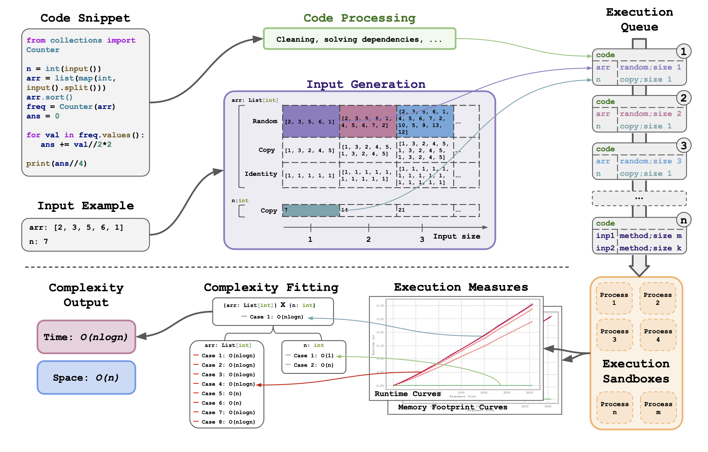

<h1 align="center">
    <p>🔬 BigO(Bench) Dynamic Complexity Inference Framework 🔬</p>
</h1>

<!--  -->

The time-space complexity framework is a rule-based algorithm that can process any Python function in order to infer its time and space complexities dynamically. 

As inputs, it takes a Python function along its function inputs and their corresponding dataclass, which are then processed and modified before being run while runtime and memory footprints are measured. From a high-level perspective, the framework increases the size of inputs following various strategies, in order to assess the impact of their size on execution metrics (e.g. execution time, memory used). When the function has several arguments, they can be expanded independently or together to determine the overall complexity of the function, taking into account potential interdependencies. The prepared code, along with the various sets of expanded inputs are queued up and run in independent sandboxes, using the Bubblewrap library, to avoid any harmful side effects of the code being run. While running, Cprofiler is used for time execution measures and tracemalloc for memory footprint. Using non-negative least squares curve fitting on each set of measures, the coefficients and residuals of each complexity class are computed. The gold complexity class output for a given set of measures is chosen as the minimizer of the residuals, taking into account a simplicity bias (the more simple the complexity class is, the smaller the simplicity bias). This curve fitting is applied on each set of measures, each corresponding to a different subset of arguments being expanded with a different expansion method. Using ensemble methods, the global complexity of the Python function is computed by aggregating the individual complexity outputs along the different set of measures. Finally, the complexity framework also returns the coefficients of the curve of each elected complexity. These coefficients can be leveraged to rank and classify the optimisations of different Python solutions within the same complexity class.

## 👋 Overview 

* [📋 Environment setup](#-environment-setup-back-to-top-back-to-root)

* [🔥 Running the complexity framework within a Python script ](#-running-the-complexity-framework-within-a-python-script-back-to-top-back-to-root)

* [🔥🔥 Running the complexity framework from the CLI](#-running-the-complexity-framework-from-the-cli-back-to-top-back-to-root)

* [🔥🔥🔥 Running the complexity framework with SLURM](#-running-the-complexity-framework-with-slurm-back-to-top-back-to-root)

* [📚 Dataset Requirements](#-dataset-requirements-back-to-top-back-to-root)

    * [Input Format 1 - `input_handler = "with_dataclass"`](#input-format-1---input_handler--with_dataclass-back-to-top-back-to-root)

    * [Input Format 2 - `input_handler = "standalone"`](#input-format-2---input_handler--standalone-back-to-top-back-to-root)

    * [Output Format](#output-format-back-to-top-back-to-root)

* [⚒️⚙️ Configuration Options](#%EF%B8%8F%EF%B8%8F-configuration-options-back-to-top-back-to-root)

    * [Dataset](#dataset-back-to-top-back-to-root)

    * [Input Handler](#input-handler-back-to-top-back-to-root)

    * [Logs/Outputs](#logsoutputs-back-to-top-back-to-root)

    * [Measurements](#measurements-back-to-top-back-to-root)

    * [Complexity Fitting](#complexity-fitting-back-to-top-back-to-root)

    * [Out of Memory/Time Handling](#out-of-memorytime-handling-back-to-top-back-to-root)

    * [CPU Allocations](#cpu-allocations-back-to-top-back-to-root)

* [👷🚧 Follow ups !](#-follow-ups--back-to-top-back-to-root)

* [License](#license-back-to-top-back-to-root)

* [📝 Citation](#-citation-back-to-top-back-to-root)

## 📋 Environment setup <sub><sup>([back to top](#-overview)) ([back to root](../../README.md#-project-overview-back-to-top))<sub><sup>

If you already have installed the repo-level dependencies that's great, you've got nothing to do !

Otherwise, you can install the complexity framework dependencies only with the following commands:

```bash
cd src/complexity
bash create_complexity_env.sh
conda activate complexity
```

In addition, if you want to test the evaluation on the data we made available on huggingface, be sure to download it first and put in the `data` root folder. You can see more data instructions at [README.md](../../data/README.md).

## 🔥 Running the complexity framework within a Python script <sub><sup>([back to top](#-overview)) ([back to root](../../README.md#-project-overview-back-to-top))<sub><sup>

On your machine within a running Python script or a jupyter notebook, you can call the framework directly. Please note that if many concurrent processes are running on your machine, for instance if you are running the framework from Python as part of an async evaluations while training a LLM in parallel, this might create important noise in the runtime and memory footprint measures. Several mechanisms down the line are implemented to mitigate these, but we do not garantee results will be as good as with the third (and most reliable) setting, using SLURM.

All default values parameters are correctly set, so to optimize the performance of the framework.
The only one to set is the source of the data via `--path_to_jsonl_file`, which must specify the path to a jsonl file of the correct format.

You can directly run

```python
from main import run_complexity_framework

run_complexity_framework(
    "source_of_data.jsonl"
)
```

If you want to turn off any CPU optimization (that only makes sense when a good number of cpus is available on your machine, at least ~40), you can set in addition

```python
from main import run_complexity_framework

run_complexity_framework(
    "source_of_data.jsonl",
    main_process_cpu_id_list = None,
    forkserver_cpu_id_list = None,
    sandbox_cpu_id_step = 1,
    sandbox_incremental_cpu_id_list = None,
    distinct_forkservers_incremental_cpu_id_list = None,
)
```

If you want to do a run as quick as possible, and log the outputs (for basic testing purposes), you can set in addition

```python
from main import run_complexity_framework

run_complexity_framework(
    "source_of_data.jsonl",
    code_end_index = 1,
    log_outputs = True,
)
```

## 🔥🔥 Running the complexity framework from the CLI <sub><sup>([back to top](#-overview)) ([back to root](../../README.md#-project-overview-back-to-top))<sub><sup>

On your local machine openning a terminal, you can run the framework directly. Please note that if many concurrent processes are running on your machine, for instance if you are using the terminal of your personal laptop, this might create important noise in the runtime and memory footprint measures. Several mechanisms down the line are implemented to mitigate these, but we do not garantee results will be as good as with the third (and most reliable) setting, using SLURM.

All default values parameters are correctly set, so to optimize the performance of the framework.
The only one to set is the source of the data via `--path_to_jsonl_file`, which must specify the path to a jsonl file of the correct format.

You can directly run

```bash
python -u -m command_line\
    --path_to_jsonl_file="source_of_data.jsonl"
```

If you want to turn off any CPU optimization (that only makes sense when a good number of cpus is available on your machine, at least ~40), you can set in addition

```bash
python -u -m command_line\
    --path_to_jsonl_file="source_of_data.jsonl" \
    --main_process_cpu_id_list="None" \
    --forkserver_cpu_id_list="None" \
    --sandbox_cpu_id_step=1 \
    --sandbox_incremental_cpu_id_list="None" \
    --distinct_forkservers_incremental_cpu_id_list="None" \
```

If you want to do a run as quick as possible, and log the outputs (for basic testing purposes), you can set in addition

```bash
python -u -m command_line\
    --path_to_jsonl_file="source_of_data.jsonl" \
    --code_end_index = 1 \
    --log_outputs
```

## 🔥🔥🔥 Running the complexity framework with SLURM <sub><sup>([back to top](#-overview)) ([back to root](../../README.md#-project-overview-back-to-top))<sub><sup>

SLURM can be used to reserve some dedicated resources for the complexity framework to run. This is certainly the most reliable way to run the framework, to ensure the surrounding noise is minimal if you can get some CPUs where little except the framework is running. In the paper, all results and measures were done using the SLURM set up.

All default values parameters are correctly set, so to optimize the performance of the framework.
The only one to set is the source of the data via `--path_to_jsonl_file`, which must specify the path to a jsonl file of the correct format.

You can directly run

```bash
sbatch slurm.sh
```

Note that as part of SLURM, our framework can be run both as a standard job and as an array job. This allow in the first case to launch a quick and simple run on fixed resources, whereas the second type allows for dynamic attribution of resources so that the framework can be run at scale on millions of code snippets. If you do not modify anything in the provided `slurm.sh` script, you will see the framework be launched one time on a single and fixed resource. 

```bash
#!/bin/bash

#SBATCH --nodes=1
#SBATCH --tasks-per-node 1
#SBATCH --cpus-per-task ***TODO***
#SBATCH --gpus-per-node=0
#SBATCH --output=logs/complexity-%x.%A.%a.%j.out
#***TODO*** set any addition parameters for SBATCH (account, partition, ...)
#SBATCH --time=1:00:00
#SBATCH --exclusive
#SBATCH --mem 0
#SBATCH --array=1-1%1

python -u -m command_line\
    --path_to_jsonl_file="source_of_data.jsonl"\
    --slurm_array_task_id=$SLURM_ARRAY_TASK_ID\
    --slurm_array_task_max=$SLURM_ARRAY_TASK_MAX\
    --slurm_array_task_min=$SLURM_ARRAY_TASK_MIN\
    --slurm_array_job_id=$SLURM_ARRAY_JOB_ID
```

To switch to several jobs splitting the work of the `source_of_data.jsonl`, you just need to modify one line ! Take `#SBATCH --array=1-n‰k`, where `n = 1` will run the job on a single fixed resource, whereas any `n > 1` will split the work in n-th parts, and you can control concurrency of the runs using the parameter k (`k = 1` will allow only one run at a time). 

## 📚 Dataset Requirements <sub><sup>([back to top](#-overview)) ([back to root](../../README.md#-project-overview-back-to-top))<sub><sup>

The complexity framework handles two types on input codes, on which to measure time and space complexity. The released datasets as part of our project on huggingface, as well as all the results detailed in our paper, do follow format 1, but in case you need it we also made a second format available !

Disclaimer: do not mix curve coefficient results obtained with the first input format and the second input format, as these are not equivalent in absolute runtime and memory footprint ! For a fixed problem, do stick to the same format. Of course, time and space complexity themselves are independent of these formats.

### Input Format 1 - `input_handler = "with_dataclass"` <sub><sup>([back to top](#-overview)) ([back to root](../../README.md#-project-overview-back-to-top))<sub><sup>

This format corresponds to the case where the code looks like this (example taken from problem name "300_A. Array")

```python
#A. Array
n = int(input())
a,b,c =[],[],[]
l = list(map(int,input().split()))
for i in l:
    if i<0:
        a.append(i)
    elif i>0:
        b.append(i)
    else:
        c.append(i)

if len(b)==0 and len(a)>2:
    b.append(a.pop())
    b.append(a.pop()) 
if len(a)%2==0:
    c.append(a.pop())    
print(len(a),*a)
print(len(b),*b)
print(len(c),*c)
```

Along with an input example to the above code that looks like this:

```python
'4\n-1 -2 -3 0\n'
```

This is the case where the input, whatever the number of distinct arguments there really is, is concatenated as a single string. In this case, the framework could not alone guess where the arguments are, without context, especially as it is not relying on any LLM (if you do have an idea on how to do that, we would love to see it working !). The framework, in order to run, needs an external `dataclass` that specifies how to understand the input string and cut it into different arguments, that the framework can then try to change to understand the time and space dependencies upon each of them. 

Using a LLM, we provide for the main problems of Code Contests these dataclasses ! You will find them on our huggingface, in the file `problem_and_human_solutions_list.jsonl` using the field `dataclass_code`. Such dataclass will look like this:

```python
@dataclass
class Input:
    n: int
    a_list: List[int]

    @classmethod
    def from_str(cls, input_: str):
        n, a_list, _ = input_.split('\n')
        n = int(n)
        a_list = list(map(int, a_list.split()))
        assert n == len(a_list)
        return cls(n, a_list)

    def __repr__(self):
        return str(self.n) + '\n' + ' '.join(map(str, self.a_list)) + '\n'
```

In practice, you will also see that the dataclass is also preceded by some additional implementation details, just for the sake of running smoothly in practice.

If you are not using problems from our provided set (where we make such dataclasses available), but that are using this specific input format (you will see that the next input format runs without a dataclass), be sure to use a LLM first to generate a dataclass of this form. With prompting and using the above example for context, it should not be too hard for the LLM to find the dataclass.

Once you have all three elements above, you can then give as input of the framework a JSONL that includes the following fields:

* `problem_name: str`
* `problem_id: str`
* `solution_id: str`
* `solution_code: str`
* `inputs_example: str`
* `dataclass_code: str`
* Any other optionnal field, that's not a problem ! They will simply be copied other to the outputs (so interesting if you want to transmit information)

If you want to try this input format, you can use the above entry points with the example located at `../../data/example_input_format_1.jsonl`.
The way the framework knows this is this format of data is with the argument `input_handler`, which is by default set to `with_dataclass`, that is to say this input format. You really just need to set the jsonl path correctly to have everything run smoothly !

```bash
python -u -m command_line\
    --path_to_jsonl_file="../../data/example_input_format_1.jsonl"\
    --log_outputs
```

### Input Format 2 - `input_handler = "standalone"` <sub><sup>([back to top](#-overview)) ([back to root](../../README.md#-project-overview-back-to-top))<sub><sup>

This format corresponds to the case where the distinction between the arguments of the code can be made directly, if the code looks like this:

```python
class Array_300_A:
    def solve(self, n, l):
        #A. Array
        a,b,c =[],[],[]
        for i in l:
            if i<0:
                a.append(i)
            elif i>0:
                b.append(i)
            else:
                c.append(i)

        if len(b)==0 and len(a)>2:
            b.append(a.pop())
            b.append(a.pop()) 
        if len(a)%2==0:
            c.append(a.pop())    
        print(len(a),*a)
        print(len(b),*b)
        print(len(c),*c)
```

And the inputs like this

```python
{"n": "4", "l": "[-1, -2, -3, 0]"}
```

Note that there is no need for the code to be wrapped into a specific class, but the framework does use the name of the variables to do the matching on what to execute, so try to be consistent between the naming of the arguments and the naming with the example of input. Once you have the above two elements, that's all ! You just need to feed a jsonl with the following data samples:

* `problem_name: str`
* `problem_id: str`
* `solution_id: str`
* `solution_code: str`
* `inputs_example: str`
* Any other optionnal field, that's not a problem ! They will simply be copied over to the outputs (so interesting if you want to transmit information)

Notice that there is indeed no need for a dataclass !

If you want to try this input format, you can use the above entry points with the example located at `../../data/example_input_format_2.jsonl`.

The way the framework knows this is this format of data is with the argument `input_handler`, which is by default set to `with_dataclass`, BUT that has to be set to a different value, let's say `standalone`, to understand the input format is number 2. You really just need to set the jsonl path correctly, AND change the value of `input_handler` in the framework parameters, to have everything run smoothly !

```bash
python -u -m command_line\
    --path_to_jsonl_file="../../data/example_input_format_2.jsonl"\
    --input_handler="standalone"\
    --log_outputs
```

### Output Format <sub><sup>([back to top](#-overview)) ([back to root](../../README.md#-project-overview-back-to-top))<sub><sup>

Beyond simple logging that is controlled with `--log_outputs`, the complexity framework can organize and save the results of its computations using `--save_results`, which defaults to True. In addition, as you'll see below, you can use the flag `--skip_saving_full_results` if you do not want to save `complexity_labels_full.json` (by default set to True, which does mean that by default this file is not saved). Using `--results_folder_name_root` allows to change the root where results will be saved.

If you are using the Python entry point of the CLI entry point, results will be zipped into a single folder of files with the following structure:

```markdown
results_folder_name_root/
├── results_run_1.zip/
│   ├── complexity_labels_light.json
│   ├── complexity_labels_full.json
│   ├── additional_logs.json
│   └── arguments_of_complexity_framework.json
├── results_run_2.zip/
│   └── ...
└── ...
```

Files will have the following structure:
* `complexity_labels_light.json`: dict list 
    * `problem_id`: str
    * `problem_name`: str    
    * `solution_id`: str
    * `time_complexity_inferred`: str, the time complexity as guessed by the complexity framework
    * `space_complexity_inferred`: str, the space complexity as guessed by the complexity framework
    * `time_curve_coefficient`: float, the coefficient of the runtime curve elected for time complexity
    * `space_curve_coefficient`: float, the coefficient of the memory footprint curve elected for space complexity
    * `additional_data_from_input`: dict, any other data given in the input, which gets forwarded here for downstream use (like evaluation pipelines)<br><br>

* `complexity_labels_full.json`: dict list
    * `problem_id`: str
    * `problem_name`: str    
    * `solution_id`: str
    * `time_complexity_inferred`: str, the time complexity as guessed by the complexity framework
    * `space_complexity_inferred`: str, the space complexity as guessed by the complexity framework
    * `time_curve_coefficient`: float, the coefficient of the runtime curve elected for time complexity
    * `space_curve_coefficient`: float, the coefficient of the memory footprint curve elected for space complexity
    * `query_dataclass_code`: str, optionnal dataclass used in the complexity framework along the input snippet of code
    * `query_code`: str, input code that was evaluated in terms of complexity by the framework
    * `query_inputs_example`: str, example of inputs on which the framework iterated, generating other inputs of different sizes to infer the complexity
    * `runtime_measures`: dict list, absolute runtime measures on which the complexity fitting was then performed
        - `measures_set_id`: str
        - `measures_per_expansion_multiplier`: dict list
            - `expansion_multiplier`: int
            - `measures_per_expansion_method`: dict list
                - `value_list`: float list
                - `expansion_method`: str
                - `measures_set_id_list`: str list
                - `measures_priority`: int 
    * `memory_footprint_measures`: dict list, absolute memory footprint measures on which the complexity fitting was then performed
        - `measures_set_id`: str
        - `measures_per_expansion_multiplier`: dict list
            - `expansion_multiplier`: int
            - `measures_per_expansion_method`: dict list
                - `value_list`: float list
                - `expansion_method`: str
                - `measures_set_id_list`: str list
                - `measures_priority`: int 
    * `runtime_measures_set_id_to_input_properties`: dict, mapping the measures_set_id for runtime_measures to the real input characteristics
    * `memory_footprint_measures_set_id_to_input_properties`: dict, mapping the measures_set_id for memory_footprint_measures to the real input characteristics
    * `additional_data_from_input`: dict, any other data given in the input, which gets forwarded here for downstream use (like evaluation pipelines) <br><br>

* `additional_logs.json`: dict list
    * `problem_id`: str
    * `problem_name`: str
    * `error_log`: str list, a not-so-organized list of errors that may have been recorded in the sandboxes during the runs. There can be many repetitions, but it does record the errors raised within the sandboxes. Do not be afraid if there are errors for a run, as this can happen even for successful evaluations (and in fact that's very frequent). For instance, some expansion methods do generate some incoherent inputs, and they then raise an error. But that does not mean that the other generation methods were not successfull in producing measures, leading to a correct complexity output.
    * `time_curve_has_a_peak`: bool, records whether a peak has been detected in the runtime curves used to infer the final complexity. This correlate with the presence of some noise in the measures. It is not catastrophic at all, but of course it does mean that there was some noise. Can be used as a proxy of how noisy the run was.
    * `space_curve_has_a_peak`:  bool, records whether a peak has been detected in the runtime curves used to infer the final complexity. This correlate with the presence of some noise in the measures. It is not catastrophic at all, but of course it does mean that there was some noise. Can be used as a proxy of how noisy the run was. <br><br>

* `arguments_of_complexity_framework.json`: dict that records all the arguments that were passed as input to the framework ! <br><br>

SLURM: you can use the slurm array configuration (in `slurm.sh`) to split accross several allocated resources over time the computations of the framework. If you are not doing a slurm array and not setting the arguments `--slurm_array_task_id`, `--slurm_array_task_max`, `--slurm_array_task_min` and `--slurm_array_job_id`, then outputs will be exactly as explained above for the python script and CLI cases. If you are using slurm arrays and setting these flags, then the structure will have an additional level, corresponding to the different slurm tasks being scheduled:

```markdown
results_folder_name_root/
├── results_run_1/
│   ├── results_run_1_task_1.zip/
│   │   ├── complexity_labels_light.json
│   │   ├── complexity_labels_full.json
│   │   ├── additional_logs.json
│   │   └── arguments_of_complexity_framework.json
│   ├── results_run_1_task_2.zip
│   │   └── ...
│   ├── results_run_1_task_3.zip
│   │   └── ...
│   └── ...
└── ...
```

Every slurm array element getting scheduled will lead to a separate zip file, within which you will find the same files as detailed above. The difference is that these files will have the complexity outputs for the subset of input samples assigned to this slurm array element to study. If you have a total dataset of 100 code samples to analyze and using a slurm array of size 10, you will get 10 task-specific zip files, each of them covering only 10 samples. 

## ⚒️⚙️ Configuration Options <sub><sup>([back to top](#-overview)) ([back to root](../../README.md#-project-overview-back-to-top))<sub><sup>

The following arguments can be passed to the Python function `run_complexity_framework`, the command line tool `command_line` or within the SLURM script `slurm.sh`. The latter also has a few SLURM-specific arguments detailed in the section above.

### Dataset <sub><sup>([back to top](#-overview)) ([back to root](../../README.md#-project-overview-back-to-top))<sub><sup>

* `path_to_jsonl_file`: Required (and only one requirement) argument to use a nested dict in the dict list of the jsonl.
* `sub_key`: Optional argument to use a nested dict in the dict list of the jsonl.
* `code_start_index`: Starting index of the codes to run.
* `code_end_index`: Ending index of the codes to run.
* `filter_on_problem`: Filter on a problem name if necessary.
* `multiply_samples_factor`: Number of times to run the framework on each sample.

### Input Handler <sub><sup>([back to top](#-overview)) ([back to root](../../README.md#-project-overview-back-to-top))<sub><sup>

* `input_handler`: Input handler to use. Can be either "with_dataclass" or the name of the class that contains the function to execute.

### Logs/Outputs <sub><sup>([back to top](#-overview)) ([back to root](../../README.md#-project-overview-back-to-top))<sub><sup>

* `log_outputs`: Whether to log outputs.
* `save_results`: Whether to save results.
* `skip_saving_full_results`: Whether to save the full results, even if `save_results` is True.
* `results_folder_name_root`: Name of the folder to save results, if results are saved.

### Measurements <sub><sup>([back to top](#-overview)) ([back to root](../../README.md#-project-overview-back-to-top))<sub><sup>

* `shuffle_runs`: Whether to shuffle runs.
* `correct_nlogn`: Whether to correct for nlogn complexity.
* `multiplier_op`: Operation to apply when scaling the size of the inputs.
* `multiplier_start`: Initial scaling factor.
* `multiplier_repeat`: Number of times to repeat measures.
* `multiplier_end`: Highest value of the multiplier.
* `multiplier_mult_step`: Step size of the multiplication of input values.
* `multiplier_max_increase`: Maximum increase of the multiplier.
* `size_of_other_arguments`: Fix size of the other arguments.
* `time_profiler`: Type of time profiler to use.

### Complexity Fitting <sub><sup>([back to top](#-overview)) ([back to root](../../README.md#-project-overview-back-to-top))<sub><sup>

* `filter_outliers`: Beta version of a filtering method to remove any outlier measures.
* `apply_penalty`: Apply penalties to the different complexity classes during the curve fitting.
* `apply_constraints`: If apply constraints, then the curve fitting is done using scipy.optimize.nnls.
* `zero_out_first_value`: Zero out first value enables to remove constant offset in the measures.
* `piecewise_fit`: Piecewise fit used to zero out any variations for the small values of inputs that can alter the curve fitting.
* `aggregate_y_values`: Used to aggregate measure values across multiple runs when `multiplier_mult_step` > 1.
* `max_time_rate`: Used for aggregating across different expansion methods of the inputs.
* `elect_complexity_time`: Used for aggregating across different expansion methods of the inputs, for time complexity.
* `elect_complexity_space`: Used for aggregating across different expansion methods of the inputs, for space complexity.
* `fix_constant_complexity`: Used for aggregating across different expansion methods of the inputs.
* `fix_negligeable_complexity`: Used for aggregating across different expansion methods of the inputs.

### Out of Memory/Time Handling <sub><sup>([back to top](#-overview)) ([back to root](../../README.md#-project-overview-back-to-top))<sub><sup>

* `temp_file_name_seed`: Used by the workers taking the measurements to offload memory to hardware memory.
* `memory_limit`: Can cancel a sandbox that uses too much memory space.
* `timeout`: Various levels of timeouts used in the workers taking the measurements.
* `large_timeout`: Various levels of timeouts used in the workers taking the measurements.
* `giga_timeout`: Various levels of timeouts used in the workers taking the measurements.
* `global_timeout`: Various levels of timeouts used in the workers taking the measurements.

### CPU Allocations <sub><sup>([back to top](#-overview)) ([back to root](../../README.md#-project-overview-back-to-top))<sub><sup>

* `max_workers`: Max workers is the maximum number of workers that can run concurrently on a node.
* `number_solutions_per_worker`: Each worker can be used to take measurement on at least one sample code.
* `main_process_cpu_id_list`: Main process cpu id list can be none if the main process of the complexity framework can be run freely on any cpus.
* `forkserver_type`: Forkserver type can be used to investigate alternative types of forkservers.
* `use_distinct_forkservers`: Use distinct forkservers can be used to leverage a different forkserver to launch sandboxes in each process.
* `forkserver_cpu_id_list`: Forkserver cpu id list similar to the main process


## 👷🚧 Follow ups ! <sub><sup>([back to top](#-overview)) ([back to root](../../README.md#-project-overview-back-to-top))<sub><sup>

The Dynamic Complexity Inference Framework can be improved in many ways. The current version that we release is more of a Proof-of-Concept, trying to see whether such framework can be used reliably on this task, for evaluation purposes of reinforcement learning. Here are a few suggestions on ways to improve it, we are happy to help and discuss any ideas or potential contributions !

* Refactoring the whole framework: the goal being to allow for flexible extensions. Some parts of the codebase, like the `input_generations`, are already designed to allow new methods of input generation. 

* Noise reduction: several methods can help with noise reduction, and therefore better accuracy of the framework as well as more stable results. Deterministic CPU operations is a huge axis of improvement, but post-processing methods on the runtime and memory footprint measures is also promising.

* Complexity definition: work on the definition of complexity and therefore how complexity is infered by the framework. Current assumptions may not be accurate, and maybe some choices in the framework implementation and not coherent with more widely spread definitions of complexity of a code snippet.

* Pure performance: the performance of the complexity framework is limited. Measuring these limitations and improving them is the priority goal.

## License <sub><sup>([back to top](#-overview)) ([back to root](../../README.md#-project-overview-back-to-top))<sub><sup>

The majority of BigO(Bench) is licensed under CC-BY-NC (see [LICENCE](/LICENSE.md)), however portions of the project are available under separate license terms: https://github.com/pberkes/big_O is licensed under the BSD-3 license.

## 📝 Citation <sub><sup>([back to top](#-overview)) ([back to root](../../README.md#-project-overview-back-to-top))<sub><sup>
If you find this repository useful, please cite this as
```
@misc{chambon2025bigobenchllmsgenerate,
      title={BigO(Bench) -- Can LLMs Generate Code with Controlled Time and Space Complexity?}, 
      author={Pierre Chambon and Baptiste Roziere and Benoit Sagot and Gabriel Synnaeve},
      year={2025},
      eprint={2503.15242},
      archivePrefix={arXiv},
      primaryClass={cs.CL},
      url={https://arxiv.org/abs/2503.15242}, 
}
```